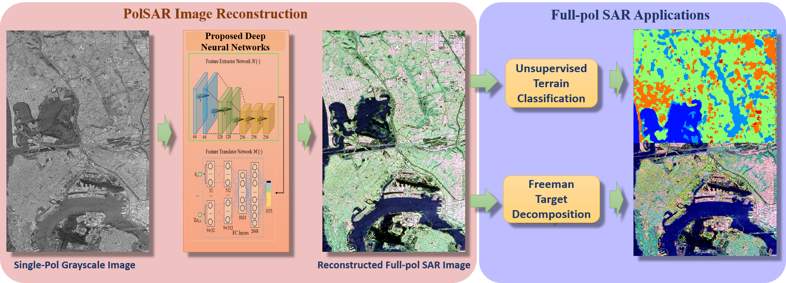
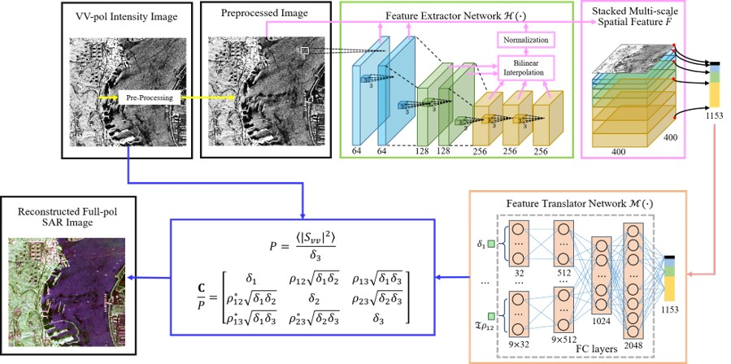
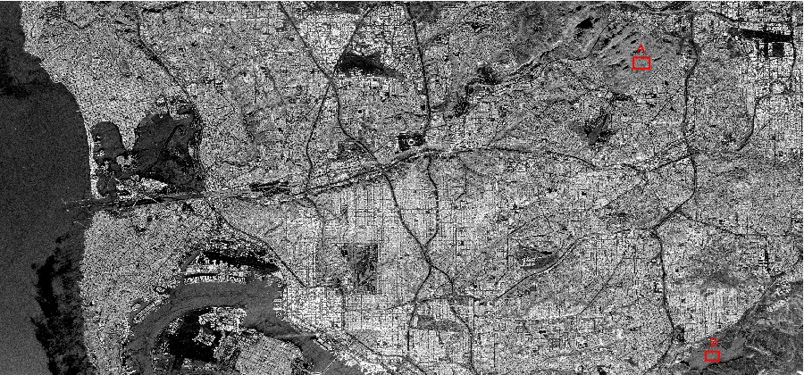
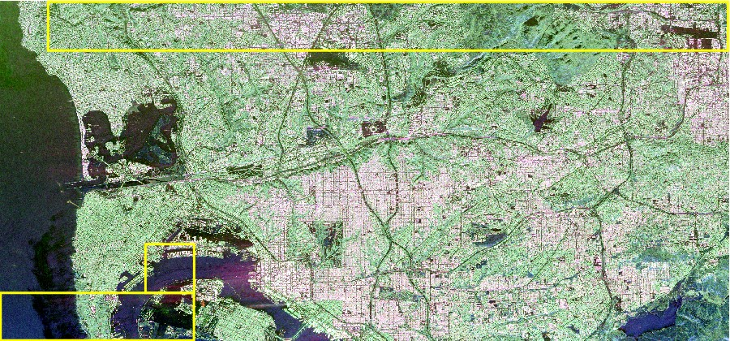
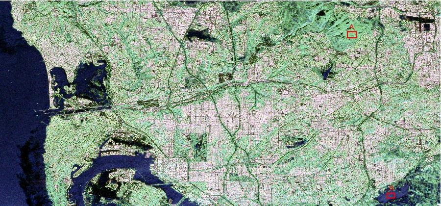

# SAR-Colorization
Code for Paper Q. Song, F. Xu, and Y.Q. Jin, "Radar Image Colorization: Converting Single-Polarization to Fully Polarimetric Using Deep Neural Networks," IEEE Access.

* Datasets that used in the paper can be downloaded from https://www.asf.alaska.edu/ select UAVSAR data acquired at San Andreas fault.

## Prerequisites
- Python 2.7
- [Tensorflow](https://www.tensorflow.org/)
- [SciPy](http://www.scipy.org/install.html)
- [NumPy](http://www.numpy.org/)
- h5py

## Useage
First, download dataset:

    $ Download the data(https://www.asf.alaska.edu/), and save it as *.mat* file.
    $  mkdir data
     ... and copy data into it.
     
To train a model:

    $ python main.py

## Results
### VV-pol SAR Image

### Actual Full-pol SAR Image

### Reconstructed Full-pol Image

## Authors
- [Qian Song](https://github.com/QianSong-Cherry)
- [Feng Xu](https://github.com/fudanxu)

## Reference
[1] Q. Song, F. Xu, and Y.Q. Jin, "Radar Image Colorization: Converting Single-Polarization to Fully Polarimetric Using Deep Neural Networks," IEEE Access.

[2] G. Larsson, M. Maire, and G. Shakhnarovich, “Learning representations for automatic colorization,” arXiv: 1603.06668, 2016.
